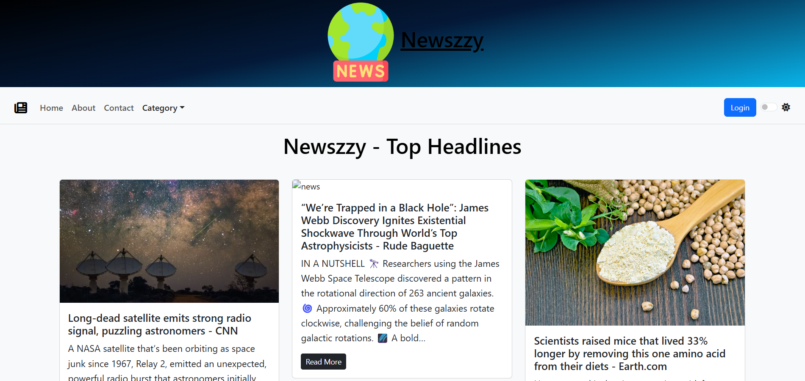

# Newzzy

Newzzy is a news aggregation and delivery platform that allows users to get the latest news from various sources, manage their preferences, and interact with news content in real time. The application is built with Node.js, Express.js, MongoDB, and integrates with the News API.

## Features

- Aggregates news from multiple sources using NewsAPI.
- User authentication and JWT-based authorization.
- User preferences and profile management.
- Dynamic and real-time news updates.
- RESTful API endpoints for all major operations.
- MongoDB for scalable data storage.

## Getting Started

### Prerequisites

- [Node.js](https://nodejs.org/) (v14 or higher)
- [MongoDB](https://www.mongodb.com/) (You can use MongoDB Atlas)
- [NewsAPI Key](https://newsapi.org/)

### Installation

1. **Clone the repository:**
   ```bash
   git clone https://github.com/0Ankit0-0/Newzzy.git
   cd Newzzy
   ```

2. **Install dependencies:**
   ```bash
   npm install
   ```

3. **Set up environment variables:**

   Create a `.env` file in the root directory and add the following:

   ```
   NEWS_API_KEY=your_news_api_key
   MONGO_URI=your_mongo_connection_string
   PORT=5001
   JWT_SECRET=your_jwt_secret
   ```

   **Important:** Never share your actual API keys, MongoDB URI, or JWT secrets publicly. The values provided in this README are examples only.

4. **Start the server:**
   ```bash
   npm start
   ```

   The server will run on `http://localhost:5001` by default.

## API Overview

- `POST /api/auth/register` – Register a new user
- `POST /api/auth/login` – User login
- `GET /api/news` – Get latest news
- `GET /api/user/profile` – Get user profile (authentication required)
- ...and more

Consult the source code or API documentation for detailed usage.

## Project Structure

```
Newzzy/
├── controllers/
├── models/
├── routes/
├── utils/
├── .env.example
├── server.js
└── README.md
```

## Seccreenshots

[](https://newzzy.vercel.app/)

##Website Link

[Visit Newszzy Live](https://newzzy.vercel.app/)

Newzzy is a news aggregation and delivery platform...

## Security Notice

**Do not commit sensitive information like API keys, database URIs, or JWT secrets to public repositories.** Always use environment variables and `.env` files, and add `.env` to your `.gitignore`.

## License

This project is licensed under the MIT License.

## Contributing

Pull requests are welcome! For major changes, please open an issue first to discuss what you would like to change.

---

**Disclaimer:** This project uses third-party APIs and services. Please comply with their terms of service.

